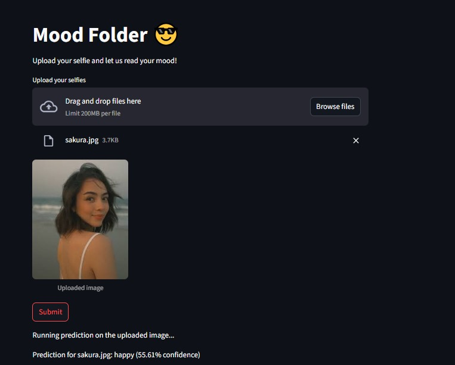

# 😄 Mood-Detection

**Mood-Detection** is a simple image classification web app that detects human emotions from images using a lightweight convolutional neural network.

It uses:
- 🧠 **PyTorch** and **Torchvision** for building and loading the model (currently a TinyVGG architecture)
- 🎛️ **Streamlit** for a clean and interactive web UI

---
## App Preview


---

## 🧠 Supported Moods

The model currently classifies input images into one of the following moods:
- 😠 Angry  
- 😢 Sad  
- 😐 Neutral  
- 😄 Happy  

---

## 🚀 How to Run the App

### 1. Clone the repository
```bash
git clone https://github.com/your-username/Mood-Detection.git
cd Mood-Detection
```

### 2. Create and activate virtual environment
```bash
python -m virtualenv venv               # For Windows (or)
python3 -m venv venv                    # For macOS/Linux
```

### 3. Activate virtual environment
```bash
venv\Scripts\activate                   # For Windows
source venv/bin/activate                # For macOS/Linux
```

### 4. Install dependencies
```bash
pip install -r requirements.txt
```

### 5. Run the streamlit app
```bash
cd src
streamlit run app.py
```
